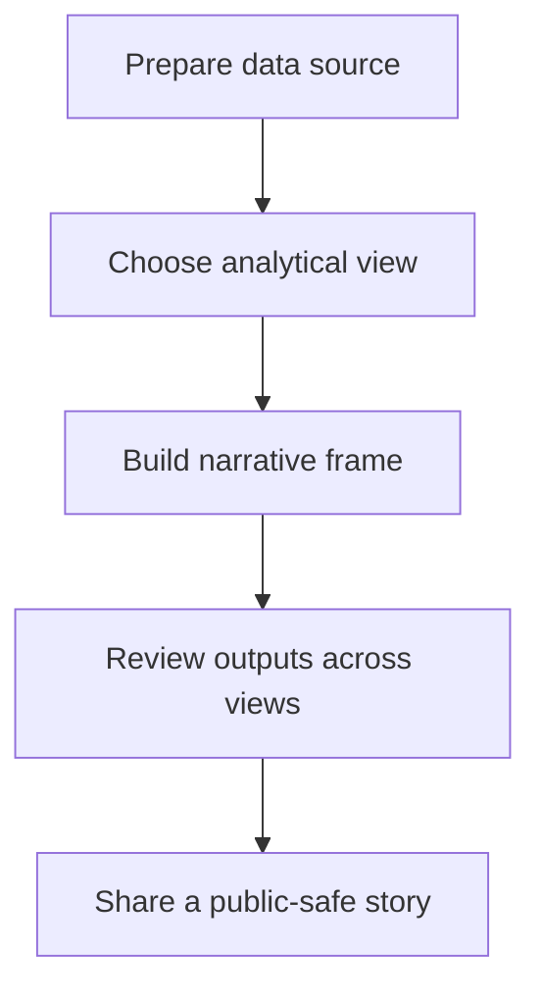

# Workflow

## High-level functional workflow
1. Prepare data source
2. Choose analytical view
3. Build narrative frame
4. Review outputs across views
5. Share a public-safe story

## Publication boundary
- The workflow is intentionally simplified.
- No internal rules, private thresholds, or sensitive processing detail are described here.
